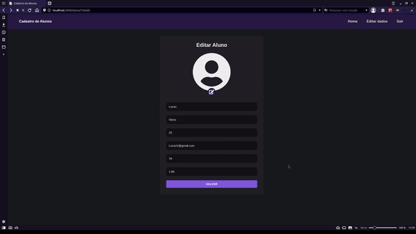

# cadastro-de-alunos

# Sobre o Projeto

Uma aplicação que consiste em um cadastro de alunos.

# Detalhes

* Na parte de design eu tirei como GRANDE inspiração o site da [Rocketseat](https://rocketseat.com.br)
* A parte de responsividade ainda não foi feita.

---

<div align="center">
  
  
  
  
  
</div>

---

## 🔨 Tecnologias usadas 🔨

Para frontend:

* [Javascript](https://www.javascript.com/)
* [React](https://reactjs.org/)
* [styled-components](https://styled-components.com)
* [Redux](https://redux.js.org)
* [Redux-Saga](https://redux-saga.js.org)
* [axios](https://www.npmjs.com/package/axios)
* [validator](https://validatejs.org)
* [lodash](https://lodash.com)
* [history](https://www.npmjs.com/package/history)
* [ESLint](https://eslint.org)
* [Prettier](https://prettier.io)

Para backend: 

* [NodeJS](https://nodejs.org/en/)
* [Express](https://expressjs.com/pt-br/)
* [MySQL Workbench](https://www.mysql.com/products/workbench/)
* [MariaDB](https://mariadb.org)
* [Sequelize](https://sequelize.org)
* [dotEnv](https://www.npmjs.com/package/dotenv)
* [ESLint](https://eslint.org)
* [Sucrase](https://sucrase.io)
* [Nodemon](https://nodemon.io)
* [CORS](https://www.npmjs.com/package/cors)

## Como executar o projeto?

```sh
  npm i
  npm run dev -> Para backend
  npm start -> Para frontend
```

Esse foi cansado :sleepy:
